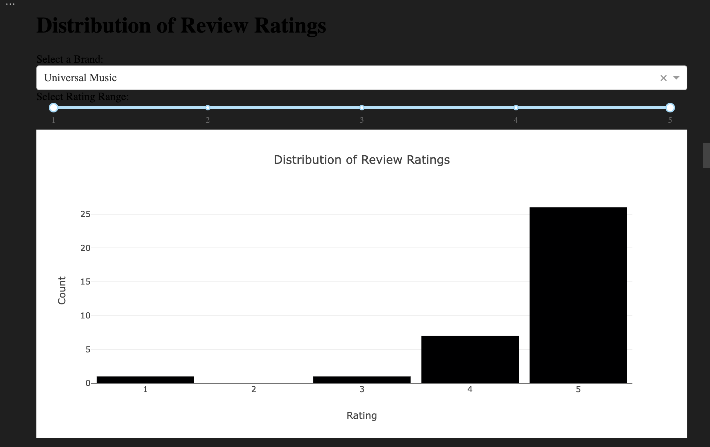
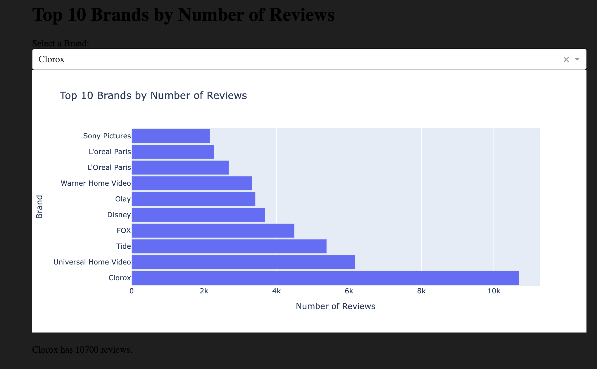
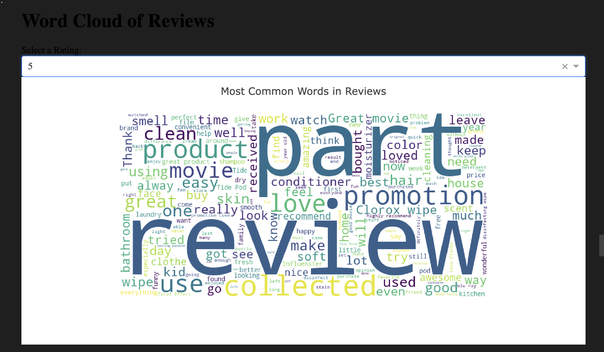
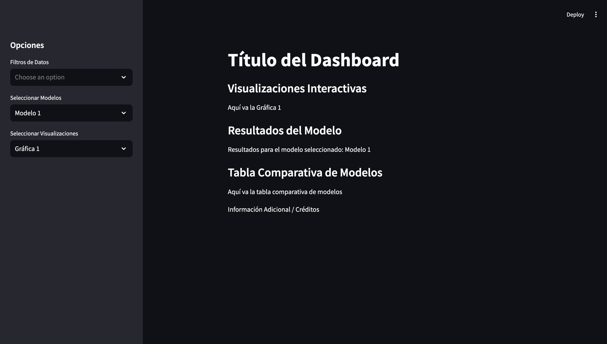
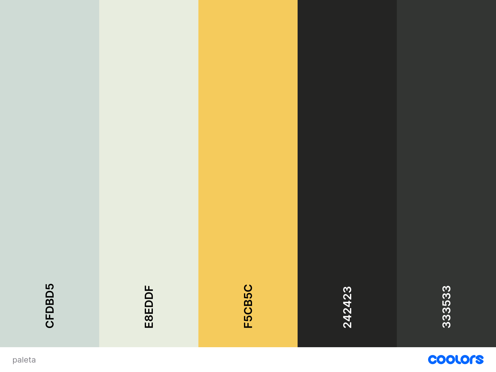

## Laboratorio 9 - Avances

## Visualizaciones
Nota: No pueden verse en el jupyter entonces se optó por subir los screenshots aquí

### Distribución de las calificaciónes de las reviews

### Top 10 marcas según el número de reviews

### World Cloud de las palabras más comunes filtradas por calificación

### Utilidad de una review comparado a la calificacion

## Bosquejo
---

## Paleta de Coloress

## División de Trabajo
### Gustavo:

Implementación de las visualizaciones interactivas.  
- Desarrollar al menos 8 visualizaciones interactivas que permitan al usuario explorar los datos.  

Desarrollo y pruebas de modelos predictivos/clasificación.  
- Implementar al menos 3 modelos y realizar pruebas de rendimiento (matrices de confusión, tasas de aprendizaje, etc.).  

Integración de gráficos enlazados en el dashboard.  
- segurarse de que los gráficos se actualicen de manera dinámica según las interacciones del usuario.  

Publicación de la aplicación.
- Si se decide publicar la aplicación, encargarse de la subida a plataformas como Shiny, Streamlit, o Plotly.  

### Marta:

Selección de la paleta de colores y justificación.  
- Elegir una paleta de colores adecuada y escribir una justificación basada en principios de UX/HCI.  

Diseño del bosquejo de la interfaz de usuario.  
- Crear un diseño visual que muestre la disposición de los elementos en el dashboard.  

Redacción del documento de decisiones tomadas (PDF).  
- Elaborar un documento que explique las decisiones del equipo sobre la implementación y diseño del dashboard.  
  
Revisión y pruebas finales del dashboard.  
- Realizar pruebas de usabilidad y asegurarse de que el dashboard sea intuitivo y fácil de usar.  